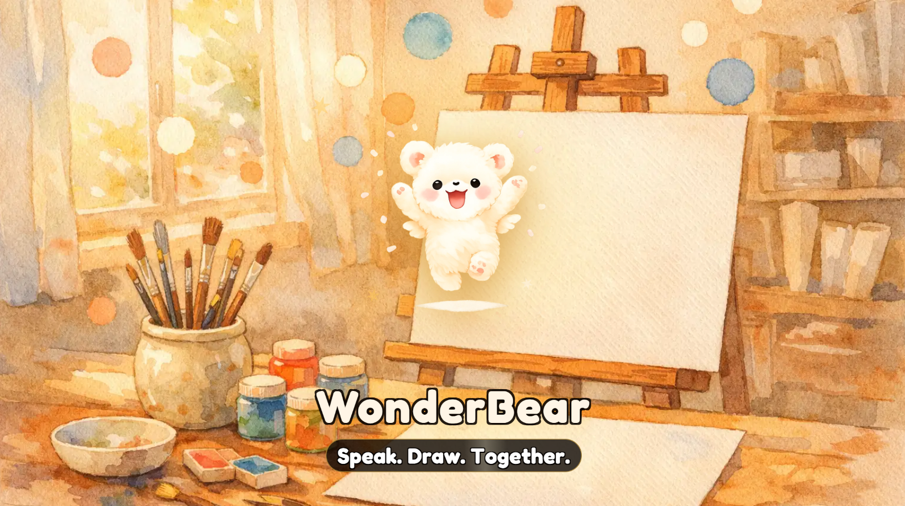

# WonderBear — Marketing Assets

  

> 主视频图 / 品牌主视觉 · Key Visual & Video Cover: `marketing-scenes/welcome.png`
> 产品主图 / Main product image: `marketing-scenes/hd-version.png`

**AI-Powered Children's Education | 75 Voice Languages · 33 UI · 15 Literacy | TV + Mobile**

> Personalized storybooks. Structured literacy. Voice AI that speaks every language.

---

## 📸 Screenshots

### `screenshots/home/` — Home Screen (33 Languages)
Full coverage: zh, en, ja, ko, ar, de, es, fr, it, pt, ru, pl, ro, hi, th, vi, id, ms, tr, nl, sv, da, nb, fi, el, bg, cs, sk, sl, hr, uk, he + more

### `screenshots/class/` — Bear Class Literacy Curriculum (8 Languages)
Systematic reading & writing: Chinese (PEP 500 chars), English (Jolly Phonics), + 6 more

### `screenshots/dialogue/` — AI Dialogue (8 Languages)
Voice conversation with AI bear → personalized storybook generation

### `screenshots/create/` — Story Creation (8 Languages)
AI-generated 10-page illustrated books with bilingual narration

### `screenshots/library/` — Story Library (8 Languages)

### `screenshots/profile/` — Child Profile & Progress (8 Languages)

### `screenshots/special/` — Course Lesson, Quiz, H5 App

---

## 📄 Documents

| File | Description |
|------|-------------|
| `docs/language-support.md` | **支持语言表 / Language Support** — 75 语音语言 (33 已接) · 15 识字 · ASR/TTS/CLASS 口径 |
| `docs/product-introduction.md` | **产品介绍（中英文）/ Product Introduction (ZH+EN)** — 硬件规格 + 核心功能 + 定价 + 营销标语 |
| `docs/functional-spec.md` | Full bilingual feature spec (Chinese + English) |
| `docs/feature-highlights-en.md` | English marketing copy |
| `docs/feature-highlights-zh.md` | Chinese marketing copy |
| `docs/vocabulary-list.md` | CLASS curriculum vocabulary (15 languages, 2,936 words) |

---

## Product Overview

**WonderBear** is an AI children's education product built into a smart projector (HY260). Children aged 3–8 talk with a bear character, which builds a personalized illustrated storybook from their ideas.

**Key Features:**
- 🐻 **AI Dialogue** — 75-language voice (33 active) conversation (Whisper ASR + Azure/CosyVoice TTS)
- 📖 **AI Storybook** — 10-page illustrated books with bilingual narration, generated in minutes
- 🏫 **Bear Class** — 15-language literacy curriculum (native phonics per language), Chinese PEP 500-char + English phonics + 13 more
- 🌍 **33 UI Languages** — Full localization for global markets
- 📱 **H5 Companion** — Web version at h5.bvtuber.com

**Hardware Highlights / 硬件亮点:**
- 🤖 **Android 14** · Allwinner **H713** · 1GB + 8GB
- 🔆 **200 ANSI Lumens** · **1920×1080P** Full HD · Auto Focus · 180° rotation
- 📡 Wi-Fi 2.4G + 5G + Bluetooth · **HDMI-IN** · USB · Bluetooth voice remote
- 📱 Built-in iOS & Android screen mirroring · YouTube TV
- ✅ Global certifications: **CE / FCC / UL / UKCA**

→ Full bilingual product introduction: [`docs/product-introduction.md`](docs/product-introduction.md)

**Repository:** [snugogo/wonderbear](https://github.com/snugogo/wonderbear)
